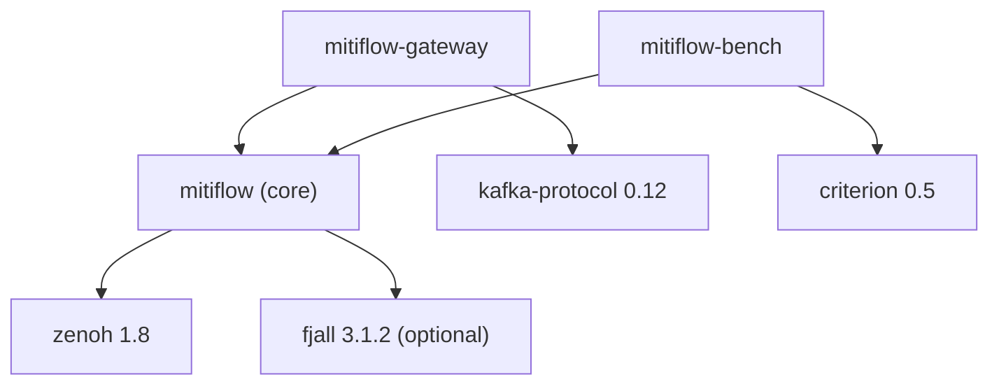
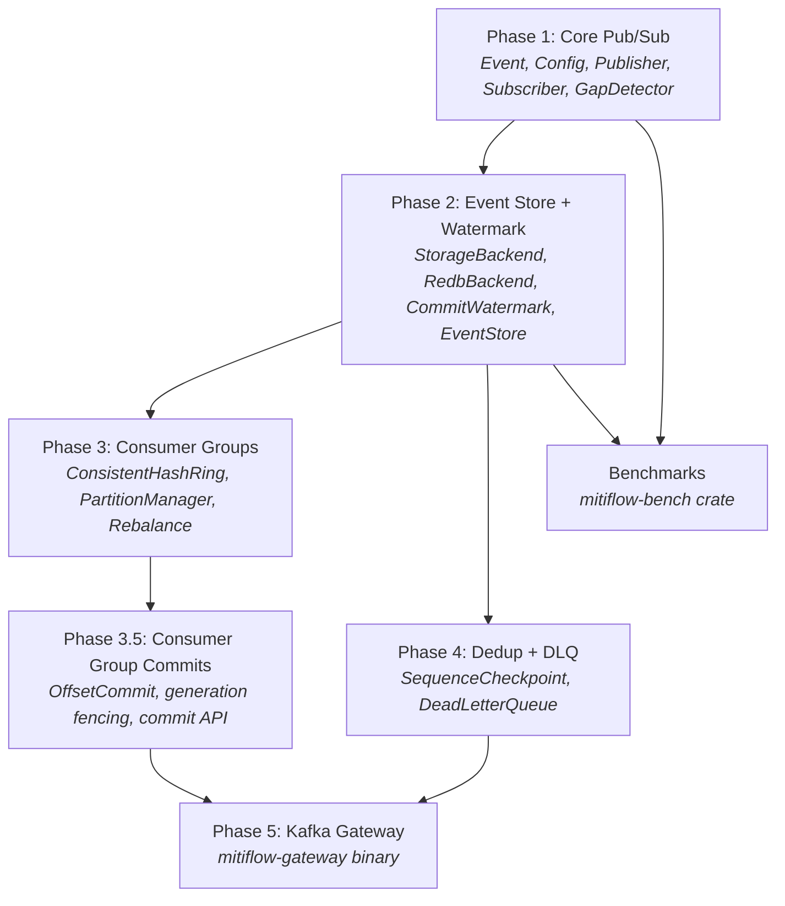

# Implementation Plan

Detailed implementation plan for the `mitiflow` crate, with test validation and benchmark strategies.

> **Status (2025-06):** Phases 1–4 and 3.5 are fully implemented. Phase 5 (Kafka Gateway) remains a stub. Benchmarks are in `mitiflow-bench/`.

> **Prerequisites:** This plan builds on the design in [00_proposal.md](00_proposal.md). Refer to [02_architecture.md](02_architecture.md) for crate structure and core types, [03_durability.md](03_durability.md) for durability protocol details, [04_sequencing_and_replay.md](04_sequencing_and_replay.md) for sequence design and HLC replay, [09_cache_recovery_design.md](09_cache_recovery_design.md) for tiered recovery, [10_graceful_termination.md](10_graceful_termination.md) for shutdown protocol, [11_consumer_group_commits.md](11_consumer_group_commits.md) for consumer group offset commits, and [ROADMAP.md](ROADMAP.md) for the Kafka gateway and other planned features.

---

## 1. Workspace Layout

The project is organized as a Cargo workspace with eight crates:

```
mitiflow/
├── Cargo.toml                    # workspace root
├── mitiflow/                     # core library crate
├── mitiflow-storage/               # multi-topic storage agent
├── mitiflow-orchestrator/        # control plane (config, lag, alerts)
├── mitiflow-cli/                 # unified CLI (agent, orchestrator, ctl)
├── mitiflow-emulator/            # topology simulation
├── mitiflow-gateway/             # Kafka protocol gateway (stub)
├── mitiflow-bench/               # comparative benchmarks
├── mitiflow-ui/                  # Svelte web dashboard
└── docs/
```

### Dependency Graph



---

## 2. Implementation Phases

### Phase 1 — Core Pub/Sub (MVP) ✅

> Reliable pub/sub over Zenoh stable APIs with sequencing, gap detection, recovery, and dedup.
>
> **Foundation:** Uses only the stable Zenoh APIs documented in [01_zenoh_capabilities.md](01_zenoh_capabilities.md) § 1. Implements layers L1 from [02_architecture.md](02_architecture.md) § 7.

#### 2.1.1 Event Envelope — `src/event.rs`

The wire format for all mitiflow events. Design from [02_architecture.md](02_architecture.md) § 4 "Event Envelope":

- `Event<T: Serialize>` — generic envelope with UUID v7 id, `chrono::DateTime<Utc>` timestamp, optional `seq: u64`, typed payload, and optional `key_expr`
- `Event::new(payload)` — constructor generating UUID v7 + current timestamp
- `impl Serialize/Deserialize` via serde derive
- Metadata encoding: `seq` and `publisher_id` are sent via Zenoh `put().attachment()` (not in the serialized body) — see [01_zenoh_capabilities.md](01_zenoh_capabilities.md) § 2.1 for the attachment protocol

**Key decision:** Sequence numbers travel in Zenoh attachments (binary, zero-copy) while the `Event<T>` body is serialized via serde. This keeps the hot-path metadata out of the serialization cost.

#### 2.1.2 Configuration — `src/config.rs`

Builder-pattern config as specified in [02_architecture.md](02_architecture.md) § 4 "Configuration":

```rust
EventBusConfig::builder("myapp/events")
    .cache_size(10_000)
    .heartbeat(HeartbeatMode::Sporadic(Duration::from_secs(1)))
    .congestion_control(CongestionControl::Block)
    .recovery_mode(RecoveryMode::Both)
    .history_on_subscribe(true)
    .build()
```

Fields split into sections: core, publisher, subscriber, store (feature-gated), partition (feature-gated). See [02_architecture.md](02_architecture.md) § 4 for the complete field listing.

#### 2.1.3 Error Types — `src/error.rs`

Comprehensive error enum via `thiserror`:

| Variant | Cause |
|---------|-------|
| `ZenohError` | Wraps `zenoh::Error` from any Zenoh operation |
| `SerializationError` | serde serialization/deserialization failure |
| `GapRecoveryFailed` | Publisher cache query returned no results for missed seqs |
| `DurabilityTimeout { seq }` | Watermark didn't cover seq within `durable_timeout` (see [03_durability.md](03_durability.md) § B) |
| `CheckpointError` | Failed to read/write sequence checkpoint |
| `StoreError` | Storage backend I/O failure |

#### 2.1.4 EventPublisher — `src/publisher/mod.rs`

Core publisher combining sequencing, caching, and heartbeat. Implements the patterns from [01_zenoh_capabilities.md](01_zenoh_capabilities.md) §§ 2.1, 2.3, 2.4:

| Component | Responsibility | Reference |
|-----------|---------------|-----------|
| `Publisher` (Zenoh) | Core `put()` with `CongestionControl::Block` | [01_zenoh_capabilities.md](01_zenoh_capabilities.md) § 2.1 |
| `HashMap<u32, AtomicU64>` partition_seqs | Per-partition monotonic sequence counter (see [04_sequencing_and_replay.md](04_sequencing_and_replay.md) § Approach C) | — |
| `VecDeque<CachedSample>` | Bounded in-memory cache for recovery | [01_zenoh_capabilities.md](01_zenoh_capabilities.md) § 2.3 |
| `Queryable` (cache) | Answers `session.get()` from subscribers on gap | [01_zenoh_capabilities.md](01_zenoh_capabilities.md) § 2.3 |
| Heartbeat loop | Periodic sequence beacon for stale connection detection | [01_zenoh_capabilities.md](01_zenoh_capabilities.md) § 2.4 |
| `Uuid publisher_id` | Unique identity for this publisher instance | — |
| Liveliness token | Presence declaration for partition manager | [01_zenoh_capabilities.md](01_zenoh_capabilities.md) § 2.6 |

**Internal architecture:**
```
EventPublisher::new() spawns:
  ├── heartbeat_task      (tokio::spawn) — periodic seq beacon
  ├── cache_queryable_task (tokio::spawn) — answers recovery queries
  └── [Phase 2] watermark_subscriber_task — listens for CommitWatermark
```

**Public API:**
- `publish(&self, event: &Event<T>) -> Result<u64>` — fast path, returns assigned seq
- `publish_to(&self, key: &str, event: &Event<T>) -> Result<u64>` — explicit partition key (seq is per this partition)
- `publish_durable(&self, event: &Event<T>) -> Result<()>` — added in Phase 2

> **Current state:** Per-partition `scc::HashMap<u32, AtomicU64>` counters are
> implemented. Each publisher maintains independent monotonic sequences per
> partition, consistent with Approach C from [04_sequencing_and_replay.md](04_sequencing_and_replay.md).

#### 2.1.5 EventSubscriber — `src/subscriber/mod.rs`

Consumer combining Zenoh subscription with gap detection and recovery. Implements [01_zenoh_capabilities.md](01_zenoh_capabilities.md) §§ 2.2, 2.3, 2.5:

| Component | Responsibility | Reference |
|-----------|---------------|-----------|
| `Subscriber` (Zenoh) | Core `subscribe()` | — |
| `GapDetector` | Per-publisher seq tracking, miss + dedup detection | [01_zenoh_capabilities.md](01_zenoh_capabilities.md) § 2.2 |
| Recovery via `session.get()` | Queries publisher cache on gap | [01_zenoh_capabilities.md](01_zenoh_capabilities.md) § 2.3 |
| History fetch | On startup, queries Event Store for historical events | [01_zenoh_capabilities.md](01_zenoh_capabilities.md) § 2.5 |
| `SequenceCheckpoint` | [Phase 4] Persisted seq for cross-restart dedup | — |

**Internal flow:**
```
incoming Sample
  → extract (pub_id, seq) from attachment
  → GapDetector.on_sample()
     ├── Normal → deliver to recv()/stream()
     ├── Gap → trigger async recovery (session.get → publisher cache or Event Store)
     └── Duplicate → drop (in-session dedup)
```

**Public API:**
- `recv<T: DeserializeOwned>(&self) -> Result<Event<T>>` — blocking receive
- `stream<T: DeserializeOwned>(&self) -> impl Stream<Item = Result<Event<T>>>` — async stream
- `on_miss(&mut self, handler: impl Fn(MissInfo))` — custom gap handler
- `ack(&self, event_id: &Uuid) -> Result<()>` — manual acknowledgment

#### 2.1.6 GapDetector — `src/subscriber/gap_detector.rs`

Stateful per-publisher sequence tracker. Algorithm from [01_zenoh_capabilities.md](01_zenoh_capabilities.md) § 2.2:

```
on_sample(pub_id, seq):
  expected = last_seen[pub_id] + 1   (or 0 if first seen)
  if seq > expected  → GAP: missed [expected..seq), trigger recovery
  if seq < expected  → DUPLICATE: already seen, drop
  if seq == expected → NORMAL: deliver, update last_seen
```

Additional heartbeat-triggered gap detection: if heartbeat says `current_seq: 50` but subscriber last saw `seq: 45`, trigger recovery for `[46..50]`.

---

### Phase 2 — Event Store + Watermark ✅

> Durable persistence with confirmed durability via watermark stream.
>
> **Foundation:** Implements the Event Store sidecar and watermark protocol from [03_durability.md](03_durability.md) §§ B, C, D. Implements layer L2 from [02_architecture.md](02_architecture.md) § 7.

#### 2.2.1 StorageBackend Trait — `src/store/backend.rs`

Pluggable storage interface. Design from [02_architecture.md](02_architecture.md) § 5 "EventStore":

```rust
pub trait StorageBackend: Send + Sync {
    fn store(&self, key: &str, event: &[u8], metadata: EventMetadata) -> Result<()>;
    fn query(&self, filters: QueryFilters) -> Result<Vec<StoredEvent>>;
    fn publisher_watermarks(&self) -> HashMap<PublisherId, PublisherWatermark>;
    fn gc(&self, older_than: DateTime<Utc>) -> Result<usize>;
    fn compact(&self) -> Result<CompactionStats>;
}
```

**`FjallBackend`** — default implementation using `fjall` 2.x (LSM-tree, pure Rust, high write throughput):

| Partition (fjall) | Key | Value | Purpose |
|-------------------|-----|-------|---------|
| `events` | `(partition: u32, publisher_id: Uuid, seq: u64)` — 28 bytes | `StoredEvent` bytes | Primary event storage |
| `metadata` | `"wm:{publisher_id}"` | `PublisherWatermark` (committed_seq + gaps) | Per-publisher watermark state |
| `keys` | `key_expr: &str` | `(partition, seq)` | Key → event lookup (for compaction) |

fjall uses a WAL + LSM-tree with configurable `flush_workers` and `compaction_workers`. Writes are durable after WAL append. Its LSM compaction runs in the background, giving consistently high write throughput compared to B-tree stores.

#### 2.2.2 CommitWatermark — `src/store/watermark.rs`

Watermark type and broadcast logic. Protocol from [03_durability.md](03_durability.md) § B "Watermark Stream":

```rust
pub struct CommitWatermark {
    pub publishers: HashMap<PublisherId, PublisherWatermark>,
    pub timestamp: DateTime<Utc>,
}

pub struct PublisherWatermark {
    pub committed_seq: u64,     // highest contiguous seq durably stored for this publisher
    pub gaps: Vec<u64>,          // seqs below committed_seq still missing
}
```

Watermarks are tracked per publisher — see [03_durability.md](03_durability.md) and [04_sequencing_and_replay.md](04_sequencing_and_replay.md) for the design rationale.

**Broadcast loop** (runs inside EventStore):
1. Every `watermark_interval` (default 100ms), compute `CommitWatermark` from backend state
2. Publish to `{key_prefix}/_watermark` via Zenoh `put()` with `CongestionControl::Block`
3. All publishers subscribe to this key and check if their pending seqs are covered

**Why watermark > per-event ACK:** See [03_durability.md](03_durability.md) § B "Why Watermark > Per-Event ACK" — O(1) network cost regardless of publisher count vs O(N × event_rate) for per-event queries.

#### 2.2.3 EventStore — `src/store/mod.rs`

Sidecar process combining subscriber, queryable, and watermark broadcaster:

```
EventStore::run() spawns:
  ├── subscribe_task     — subscribes to events/**, persists to backend
  ├── queryable_task     — answers session.get() for replay/queries
  ├── watermark_task     — periodic CommitWatermark broadcast
  └── gc_task            — periodic garbage collection
```

The Event Store uses its own `GapDetector` to detect gaps in incoming events. On gap, it recovers from publisher caches via `session.get()` — exactly the same recovery mechanism subscribers use (see [01_zenoh_capabilities.md](01_zenoh_capabilities.md) § 2.3).

#### 2.2.4 QueryFilters — `src/store/query.rs`

Parses Zenoh selector parameters into structured filters:

```
session.get("myapp/store/**?after_seq=100&before_seq=200&after_time=2024-01-01T00:00:00Z")
```

Supported filters:
- `after_seq` / `before_seq` — sequence range
- `after_time` / `before_time` — timestamp range
- `limit` — max results
- Custom payload field filters (app-specific, via `run_with_filter()`)

This is a differentiating feature vs Kafka — see [06_comparison.md](06_comparison.md) § 3 "App-specific queries" row.

#### 2.2.5 Durable Publish — `src/publisher/mod.rs` (modification)

Adds `publish_durable()` to EventPublisher. Protocol from [03_durability.md](03_durability.md) § B "Publisher Side":

```
publish_durable(event):
  1. seq = publish(event)          // fast path
  2. wait_for_watermark(seq)       // block until watermark.committed_seq >= seq
     └── timeout after durable_timeout → Error::DurabilityTimeout
```

Publisher subscribes to watermark key on construction and routes `CommitWatermark` messages through a `flume` channel.

---

### Phase 3 — Partitioned Consumer Groups ✅

> Load-balanced consumption via rendezvous hashing + liveliness-driven rebalancing.
>
> **Foundation:** Implements layer L3 from [02_architecture.md](02_architecture.md) § 7. Uses Zenoh liveliness from [01_zenoh_capabilities.md](01_zenoh_capabilities.md) § 2.6.

#### 2.3.1 ConsistentHashRing — `src/partition/hash_ring.rs`

Rendezvous (Highest Random Weight) hashing for partition → worker assignment:

```
partition_for(key: &str) -> u32:
    hash(key) % num_partitions

worker_for(partition: u32, workers: &[WorkerId]) -> WorkerId:
    workers.max_by_key(|w| hash(w, partition))  // HRW
```

Properties:
- **Deterministic:** Same key always maps to same partition
- **Minimal disruption:** Adding/removing a worker reassigns only `1/N` of partitions
- **No coordination:** Each worker can independently compute the assignment

#### 2.3.2 PartitionManager — `src/partition/mod.rs`

Worker membership + partition ownership:

| Component | Mechanism |
|-----------|-----------|
| Worker registration | `session.liveliness().declare_token("{prefix}/$workers/{worker_id}")` |
| Membership discovery | `session.liveliness().declare_subscriber("{prefix}/$workers/*")` |
| Join/leave detection | Liveliness events → hash ring update → rebalance callback |

**Public API:**
- `partition_for(key) -> u32` — deterministic key → partition mapping
- `my_partitions() -> Vec<u32>` — partitions owned by this worker
- `on_rebalance(cb: impl Fn(&[u32], &[u32]))` — callback `(gained, lost)` partitions
- `subscription_key_expr() -> String` — Zenoh key expr matching owned partitions only

#### 2.3.3 Rebalance Logic — `src/partition/rebalance.rs`

On membership change (worker join or leave detected via liveliness):

```
1. Update worker list from liveliness state
2. Recompute partition assignment via ConsistentHashRing
3. Diff old vs new assignment for this worker
4. Call on_rebalance(gained_partitions, lost_partitions)
5. Update Zenoh subscriber key expression to match new assignment
```

**Cooperative rebalance:** Only affected partitions pause — other partitions continue processing. This is an improvement over Kafka's "stop the world" rebalance (see [ROADMAP.md](ROADMAP.md) § Kafka Gateway).

---

### Phase 3.5 — Consumer Group Commits ✅

> Store-managed offset commits with generation fencing.
>
> **Foundation:** Full design in [11_consumer_group_commits.md](11_consumer_group_commits.md).
> E2E test plan in [11_consumer_group_commits.md](11_consumer_group_commits.md) Part 10.

#### 2.3.5.1 Offset Keyspace — `src/store/backend.rs` (extension)

Add `offsets` keyspace to `FjallBackend`:
- Key: `[group_id_hash:8][publisher_id:16]`
- Value: `[seq:8 BE][generation:8 BE][timestamp_ms:8 BE]`
- `commit_offsets(&OffsetCommit)` with generation fencing
- `fetch_offsets(group_id) -> HashMap<PublisherId, u64>` via prefix scan

#### 2.3.5.2 Offset Subscribe + Queryable — `src/store/runner.rs` (extension)

- Subscribe to `{key_prefix}/_offsets/{partition}/**` and persist commits
- Queryable on `{key_prefix}/_offsets/{partition}/**` for offset fetch

#### 2.3.5.3 Consumer Commit API — `src/subscriber/mod.rs` (extension)

- `commit_sync()` — query-based, waits for store ACK
- `commit_async()` — fire-and-forget put
- `load_offsets(partition)` — fetches via `session.get()`, seeds `GapDetector`
- `new_consumer_group()` — constructor joining group via `PartitionManager`

#### 2.3.5.4 Configuration — `src/config.rs` (extension)

- `ConsumerGroupConfig` with `group_id`, `member_id`, `CommitMode::Manual|Auto`, `OffsetReset`

#### 2.3.5.5 Generation Counter — `src/partition/mod.rs` (extension)

- `generation: AtomicU64` on `PartitionManager`, incremented on every rebalance
- `current_generation() -> u64`

---

### Phase 4 — Cross-Restart Dedup + DLQ ✅

> Exactly-once semantics across restarts and poison message isolation.
>
> **Foundation:** Implements layers L4 and L5 from [02_architecture.md](02_architecture.md) § 7.

#### 2.4.1 SequenceCheckpoint — `src/subscriber/checkpoint.rs`

Persisted per-publisher sequence tracking (fjall-backed):

```rust
pub struct SequenceCheckpoint {
    partition: fjall::PartitionHandle,  // persisted to disk
}

impl SequenceCheckpoint {
    fn ack(&self, pub_id: &Uuid, seq: u64) -> Result<()>;
    fn last_checkpoint(&self, pub_id: &Uuid) -> Result<Option<u64>>;
    fn restore_from(&self) -> Result<HashMap<Uuid, u64>>;
}
```

On subscriber restart:
1. Load `last_checkpoint` for each known publisher from fjall
2. Initialize `GapDetector` with these as `last_seen` values
3. Any events with `seq <= last_checkpoint` are dropped as duplicates
4. Request replay from `last_checkpoint + 1` via Event Store

#### 2.4.2 DeadLetterQueue — `src/dlq.rs`

Poison message isolation:

| Config | Default | Purpose |
|--------|---------|---------|
| `max_retries` | 3 | How many times to attempt processing before DLQ |
| `dlq_key_prefix` | `{key_prefix}/$dlq` | Key expression for dead-lettered events |
| `retry_backoff` | Exponential (1s, 2s, 4s) | Delay between retries |

Flow:
```
event fails processing → increment retry counter
  → retry_count < max_retries → re-deliver after backoff
  → retry_count >= max_retries → publish to dlq_key_prefix → ack original
```

DLQ events are stored as regular events in a separate key-space, queryable by the EventStore if configured to subscribe to `$dlq/**`.

---

### Phase 5 — Kafka Protocol Gateway (stub)

> Kafka wire protocol compatibility layer. **Not yet implemented.**
>
> **Foundation:** Full design in [ROADMAP.md](ROADMAP.md) § Kafka Gateway. This is a **separate binary crate** (`mitiflow-gateway`), not part of the core library.
>
> **Architectural note:** The gateway acts as a Kafka-compatible broker — it
> serializes writes per partition to assign monotonic offsets, which is
> inherently brokered coordination. This is a conscious trade-off: native
> mitiflow clients bypass the gateway entirely and benefit from the brokerless
> per-(partition, publisher) model, while Kafka clients get the familiar
> offset-based API through the gateway at the cost of a serialization point.
> See [04_sequencing_and_replay.md](04_sequencing_and_replay.md) § "The Brokerless Constraint" for why
> total partition order cannot be achieved without coordination.

#### 2.5.1 Gateway Architecture

As specified in [ROADMAP.md](ROADMAP.md) § Kafka Gateway:

```
mitiflow-gateway/
├── src/
│   ├── main.rs              # TCP listener on :9092, config, startup
│   ├── connection.rs        # Per-client connection state machine
│   ├── state.rs             # Shared state (Zenoh sessions, topic registry, stores)
│   ├── mapper.rs            # Topic ↔ key expression bidirectional mapping
│   └── protocol/
│       ├── mod.rs           # API key dispatcher
│       ├── produce.rs       # ProduceRequest → EventPublisher
│       ├── fetch.rs         # FetchRequest → EventSubscriber / Store query
│       ├── metadata.rs      # MetadataRequest → topology info
│       ├── offset.rs        # OffsetCommit/Fetch → EventSubscriber commit API (see [11_consumer_group_commits.md](11_consumer_group_commits.md))
│       ├── group.rs         # Consumer group lifecycle → PartitionManager
│       └── admin.rs         # CreateTopics, DeleteTopics, DescribeConfigs
```

#### 2.5.2 Implementation Sub-Phases

**Phase 5a: Read/Write (MVP)**
- 6 API keys: Produce, Fetch, Metadata, OffsetCommit, OffsetFetch, ListOffsets
- acks mapping: `acks=0` → fire-and-forget, `acks=1` → Block, `acks=all` → `publish_durable()` — see [ROADMAP.md](ROADMAP.md) § Kafka Gateway
- Fetch: live stream via `EventSubscriber` + historical replay via Event Store queryable — see [ROADMAP.md](ROADMAP.md) § Kafka Gateway
- Validation: `rdkafka` Rust client smoke test

**Phase 5b: Consumer Groups**
- 5 API keys: FindCoordinator, JoinGroup, SyncGroup, Heartbeat, LeaveGroup
- Maps to `PartitionManager` — see [ROADMAP.md](ROADMAP.md) § Kafka Gateway
- OffsetCommit/Fetch via `EventSubscriber::commit_sync()` / `load_offsets()` (see [11_consumer_group_commits.md](11_consumer_group_commits.md))
- Validation: `kafka-console-consumer` with `--group`

**Phase 5c: Admin + Polish**
- 4 API keys: CreateTopics, DeleteTopics, DescribeConfigs, DeleteRecords
- Validation: `kafka-topics` CLI tool

---

## 3. Verification Plan

### 3.1 Unit Tests

Located in `mitiflow/tests/`, run with `cargo test -p mitiflow`:

#### `tests/reliability.rs` — Phase 1

| Test | Verifies |
|------|----------|
| `test_event_envelope_roundtrip` | `Event<T>` serialize → deserialize preserves all fields |
| `test_sequence_monotonic` | `EventPublisher` assigns strictly increasing seqs |
| `test_attachment_encoding` | seq + pub_id correctly encoded in Zenoh attachments |
| `test_gap_detection_single_publisher` | GapDetector returns `MissInfo` when seq jumps |
| `test_gap_detection_multi_publisher` | Independent seq tracking per publisher |
| `test_dedup_duplicate_seq` | GapDetector drops already-seen seq |
| `test_recovery_from_publisher_cache` | On gap, `session.get()` to cache queryable returns missed events |
| `test_heartbeat_triggers_recovery` | Heartbeat with `current_seq` ahead of `last_seen` triggers recovery |
| `test_config_builder_defaults` | `EventBusConfig::builder("x").build()` has correct defaults |
| `test_config_builder_overrides` | All builder fields can be overridden |

#### `tests/store.rs` — Phase 2

| Test | Verifies |
|------|----------|
| `test_fjall_store_and_query` | Store event → query by seq range → returns correct events |
| `test_fjall_query_by_time` | Store events with different timestamps → query by time range |
| `test_fjall_committed_seq` | `publisher_watermarks()` returns correct per-publisher committed_seq |
| `test_fjall_gap_sequences` | Missing seqs appear in per-publisher gaps |
| `test_fjall_gc` | GC removes events older than threshold |
| `test_fjall_compact` | Compaction keeps only latest event per key |
| `test_query_filters_parsing` | Zenoh selector string → `QueryFilters` struct |

#### `tests/watermark.rs` — Phase 2

| Test | Verifies |
|------|----------|
| `test_watermark_broadcast` | EventStore publishes `CommitWatermark` at configured interval |
| `test_publish_durable_blocks` | `publish_durable()` doesn't return until watermark covers seq |
| `test_publish_durable_timeout` | Returns `DurabilityTimeout` if watermark not received in time |
| `test_watermark_with_gaps` | Seq in `gaps[]` → publisher continues waiting |
| `test_watermark_gap_clears` | After Event Store recovers gap, next watermark clears it |

#### `tests/partition.rs` — Phase 3

| Test | Verifies |
|------|----------|
| `test_hash_ring_deterministic` | Same key + same workers → same partition |
| `test_hash_ring_minimal_disruption` | Adding 1 worker reassigns ≤ `total_partitions / (N+1)` partitions |
| `test_rebalance_on_join` | New worker joins → rebalance callback fires with correct gained/lost |
| `test_rebalance_on_leave` | Worker leaves → remaining workers pick up orphan partitions |
| `test_subscription_key_expr` | Generated key expr matches only owned partitions |

#### `tests/dedup.rs` — Phase 4

| Test | Verifies |
|------|----------|
| `test_checkpoint_persist_restore` | Write checkpoint → close → reopen → read same value |
| `test_cross_restart_dedup` | After restart with checkpoint, duplicate events are dropped |

#### `tests/dlq.rs` — Phase 4

| Test | Verifies |
|------|----------|
| `test_dlq_retry_count` | Events retried up to `max_retries` before DLQ routing |
| `test_dlq_routing` | After max retries, event appears on `$dlq/**` key expression |
| `test_dlq_exponential_backoff` | Retry delays follow configured backoff |

#### `tests/gateway.rs` — Phase 5

| Test | Verifies |
|------|----------|
| `test_kafka_produce_fetch_roundtrip` | `rdkafka` produce → fetch via gateway returns same data |
| `test_kafka_acks_mapping` | `acks=0,1,all` routed to correct mitiflow publish strategy |
| `test_kafka_consumer_group` | JoinGroup → SyncGroup → partition assignment works |
| `test_kafka_offset_commit_fetch` | OffsetCommit → OffsetFetch returns committed offset |

### 3.2 Integration Tests (End-to-End)

Located in `mitiflow/tests/`, require real Zenoh sessions (peer mode, no broker/router needed). Run with `cargo test -p mitiflow --test 'e2e_*'`:

| Test | Setup | Scenario | Expected |
|------|-------|----------|----------|
| `e2e_pubsub` | 1 publisher, 1 subscriber (separate tasks) | Publish 10K events | All 10K received in order, no duplicates |
| `e2e_multi_publisher` | 3 publishers, 1 subscriber | Each publishes 1K events | 3K total received, per-publisher ordering preserved |
| `e2e_gap_recovery` | 1 publisher, 1 subscriber | Artificially delay/drop N events from transport | Subscriber detects gap, recovers from publisher cache |
| `e2e_store_replay` | 1 publisher, 1 store, 1 late subscriber | Publish 1K → start subscriber | Subscriber receives all 1K via history replay |
| `e2e_durable_publish` | 1 publisher, 1 store | `publish_durable()` 100 events | All complete within `watermark_interval + epsilon` |
| `e2e_store_crash_recovery` | 1 publisher, 1 store | Kill store after 500 events → restart | Store replays from disk, no events lost |
| `e2e_partition_rebalance` | 3 workers, 64 partitions | Kill 1 worker mid-stream | 2 remaining workers pick up all 64 partitions, no events lost |
| `e2e_kafka_gateway` | Gateway + publisher + store | `rdkafka` produce 1K → consume 1K | All events round-trip through Kafka protocol |

### 3.3 Benchmarks

Dedicated `mitiflow-bench` crate using [criterion](https://crates.io/crates/criterion) for statistical rigor. Results go to `target/criterion/` (HTML) and `target/benchmark-results/` (JSON).

```
mitiflow-bench/
├── Cargo.toml
├── benches/
│   ├── throughput.rs        # publish + subscribe throughput
│   ├── latency.rs           # publish + durable_publish latency
│   ├── store.rs             # storage backend read/write
│   ├── watermark.rs         # watermark overhead profiling
│   ├── partition.rs         # rebalance timing
│   └── comparison.rs        # side-by-side vs Kafka
└── src/
    └── lib.rs               # shared setup utilities
```

#### Throughput Benchmarks — `benches/throughput.rs`

| Benchmark | Parameters | Metric | Baseline |
|-----------|-----------|--------|----------|
| `bench_publish_throughput` | Payload: 64B, 1KB, 64KB | msgs/s, MB/s | Raw Zenoh `put()` (measures mitiflow overhead) |
| `bench_subscribe_throughput` | With / without GapDetector | msgs/s | Raw Zenoh subscriber |
| `bench_publish_subscribe_e2e` | 1 pub → 1 sub, varying payloads | msgs/s end-to-end | — |
| `bench_multi_publisher` | 1, 5, 10, 50 publishers → 1 sub | aggregate msgs/s | Linear scaling expected |

#### Latency Benchmarks — `benches/latency.rs`

| Benchmark | Parameters | Metric | Expected |
|-----------|-----------|--------|----------|
| `bench_publish_latency` | Single event, 64B payload | p50, p95, p99 | < 2× raw Zenoh put |
| `bench_durable_publish_latency` | Single event, watermark confirm | p50, p95, p99 | ≈ `watermark_interval` + transmission |
| `bench_subscribe_latency` | Time from `put()` to `recv()` delivery | p50, p95, p99 | < 2× raw Zenoh sub |

#### Store Benchmarks — `benches/store.rs`

| Benchmark | Parameters | Metric |
|-----------|-----------|--------|
| `bench_store_write` | Batch: 1, 10, 100 events | events/s, fsync cost |
| `bench_store_query_by_seq` | Dataset: 1K, 10K, 100K events | query latency |
| `bench_store_query_by_time` | Dataset: 10K events, varying ranges | query latency |
| `bench_store_gc` | 100K events, GC 50% | time to GC |
| `bench_store_compact` | 10K keys, 10 versions each | compaction time |

#### Watermark Overhead — `benches/watermark.rs`

| Benchmark | Parameters | Metric |
|-----------|-----------|--------|
| `bench_watermark_cpu` | Interval: 10ms, 50ms, 100ms, 500ms | CPU time per watermark tick |
| `bench_watermark_network` | Interval: 10ms, 50ms, 100ms, 500ms | bytes/s on watermark channel |
| `bench_durable_batch_throughput` | N concurrent `publish_durable()` | aggregate confirmed/s |

#### Kafka Comparison — `benches/comparison.rs`

> [!IMPORTANT]
> Requires a running Kafka broker for comparison. Use `docker compose up kafka` to start.

| Benchmark | Setup | Metric |
|-----------|-------|--------|
| `bench_mitiflow_vs_kafka_latency` | Same payload, same machine | p50/p95/p99 latency side-by-side |
| `bench_mitiflow_vs_kafka_throughput` | 64B payload, 10s sustained | msgs/s side-by-side |
| `bench_mitiflow_vs_kafka_durable` | `acks=all` / `publish_durable()` | confirmed events/s |

Expected results based on benchmarks cited in [06_comparison.md](06_comparison.md) § 2:
- **Latency:** mitiflow 100-1000× lower (µs vs ms)
- **Throughput:** mitiflow 5-10× higher (peer mode) for small payloads
- **Durable latency:** mitiflow dominated by `watermark_interval` (~100ms) vs Kafka ISR (~5-50ms with replication)

**Commands:**
```bash
# All benchmarks
cargo bench -p mitiflow-bench

# Specific benchmark group
cargo bench -p mitiflow-bench -- throughput

# Kafka comparison (requires docker compose)
docker compose -f mitiflow-bench/docker-compose.yml up -d
cargo bench -p mitiflow-bench -- comparison
docker compose -f mitiflow-bench/docker-compose.yml down
```

### 3.4 Manual Verification Milestones

These are sign-off checkpoints for each phase, not automated tests:

| Phase | Milestone | Procedure |
|-------|-----------|-----------|
| 1 | Multi-process pub/sub | Run publisher and subscriber as separate `cargo run --example` processes, verify events arrive in order |
| 2 | Store crash recovery | Start store → publish 1K events → `kill -9` store → restart → verify all 1K events queryable |
| 2 | Durable publish confirmation | Observe `publish_durable()` latency via tracing logs |
| 3 | Live rebalance | Start 3 consumers → kill 1 → verify partitions redistribute without event loss |
| 5 | Kafka CLI compatibility | `kafka-console-producer` + `kafka-console-consumer` against gateway |
| 5 | Kafka Connect | Run a simple Kafka Connect sink connector through gateway |

---

## 4. Implementation Order & Dependencies



Each phase is independently testable and shippable. Phase 1 is a usable MVP — a reliable event bus over Zenoh. Benchmarks can begin after Phase 1 and grow as new features land.

---

## 5. Phase Status

| Phase | Status | Notes |
|-------|--------|-------|
| 1: Core Pub/Sub | ✅ Complete | Per-partition sequencing, gap detection, tiered recovery, heartbeat |
| 2: Event Store + Watermark | ✅ Complete | FjallBackend, watermark broadcast, durable publish, GC |
| 3: Consumer Groups | ✅ Complete | HRW hashing, liveliness rebalance, ConsumerGroupSubscriber |
| 3.5: Consumer Group Commits | ✅ Complete | Generation-fenced offsets, manual + auto commit |
| 4: Dedup + DLQ | ✅ Complete | SequenceCheckpoint, DeadLetterQueue |
| 5: Kafka Gateway | ⬜ Stub | Crate exists, protocol handlers not implemented |
| Benchmarks | ✅ Complete | mitiflow-bench with Kafka/NATS/Redis/Redpanda comparisons |

---

## 6. Extended Features Status

Features beyond the core library phases, tracked across the codebase.

### Completed

| Feature | Crate | Tests | Ref |
|---------|-------|-------|-----|
| Consumer Group Commits | `mitiflow` | 8 tests in `consumer_group_commit.rs` | [11_consumer_group_commits.md](11_consumer_group_commits.md) |
| Orchestrator (config, lag, admin, HTTP API) | `mitiflow-orchestrator` | 28 + 15 + 7 tests | [11_consumer_group_commits.md](11_consumer_group_commits.md) |
| Key-Based Publishing (phases 1–4) | `mitiflow` | `keyed_publish.rs`, `key_scoped.rs` | [15_key_based_publishing.md](15_key_based_publishing.md) |
| Deterministic Replay (HLC + lifecycle) | `mitiflow` | Part of `store.rs` | [04_sequencing_and_replay.md](04_sequencing_and_replay.md) |
| Distributed Storage (Tier 1 + Tier 2) | `mitiflow-storage` | 47+ tests across 10 test files | [13_distributed_storage.md](13_distributed_storage.md) |
| Multi-Topic Agent & DX (phases A–F) | `mitiflow-storage`, `mitiflow-cli` | topic_supervisor, topic_watcher, yaml_config tests | [16_dx_and_multi_topic.md](16_dx_and_multi_topic.md) |
| Slow Consumer Offload (core) | `mitiflow` | 14 unit + 6 E2E tests | [17_slow_consumer_offload.md](17_slow_consumer_offload.md) |
| Graceful Termination | `mitiflow` | Integrated in existing tests | [10_graceful_termination.md](10_graceful_termination.md) |
| Emulator (phases 1–3) | `mitiflow-emulator` | Topology runner tests | `mitiflow-emulator/DESIGN.md` |
| GUI (phases 1–7) | `mitiflow-ui`, `mitiflow-orchestrator` | HTTP API + Vitest | `mitiflow-ui/DESIGN.md` |
| Alert Manager | `mitiflow-orchestrator` | 8 unit tests | — |
| Replication (multi-store + recovery) | `mitiflow-storage` | recovery.rs (5 tests) | [05_replication.md](05_replication.md) |

### Open / Deferred

| Item | Notes |
|------|-------|
| Kafka Gateway (phases 5a–5c) | Stub only. See [ROADMAP.md](ROADMAP.md). |
| Key-Scoped Subscribing (Mode 2: store queries) | Design only. See [ROADMAP.md](ROADMAP.md). |
| Orchestrator HA | Leader election via liveliness + lowest UUID |
| Quorum watermark tracker | `QuorumTracker` collecting watermarks from N replicas |
| Publisher quorum confirmation | `publish_durable()` waiting for quorum instead of single-store |
| Durability levels (Single/Quorum/All) | Configurable per-publish |
| OpenTelemetry integration | `tracing-opentelemetry` + `opentelemetry-prometheus` |
| `mitiflow dev` subcommand | Co-locate orchestrator + agent + Zenoh router in one process |
| Auto-drain on node failure | Automatic override generation when node goes offline |
| Rebalance advisor | Load-aware override generation |
| Topic data deletion command | Orchestrator triggers on-disk cleanup on agents |
| Consumer group offload compatibility | Test offload with `ConsumerGroupSubscriber` |
| Remove `history_on_subscribe` | Dead config field never acted upon |
| `tests/watermark.rs` full suite | Currently partial in `store.rs` |
| GUI E2E tests (Playwright) | Not yet written |
| GUI CI (build + embed in release) | Not yet configured |

---

## 7. Resolved Questions

| # | Question | Resolution |
|---|----------|------------|
| 1 | Should Phase 5 (Gateway) be deferred? | Yes — see [ROADMAP.md](ROADMAP.md). |
| 2 | Include NATS JetStream in benchmarks? | Yes — `mitiflow-bench` includes Kafka, NATS, Redis, Redpanda. |
| 3 | PostgreSQL backend? | fjall-only for now. `StorageBackend` trait allows future backends. |
| 4 | Minimum supported Zenoh version? | Zenoh 1.8 (current). |
| 5 | CI pipeline? | GitHub Actions with `cargo nextest run --features full`. |
