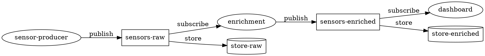

# Emulator — Local Topology Runner & Chaos Testbed

**Status:** Implemented (Phase 1–3 complete, Phase 4–5 partial)  
**Crate:** `mitiflow-emulator`

---

## 1  Motivation

Developing and testing a multi-component Mitiflow deployment today requires
manually starting each binary in a separate terminal with ad-hoc environment
variables. There is no unified way to:

- Define a complete topology (producers → processors → consumers, with storage
  agents and orchestrator) in a single file
- Spin it up with one command
- Aggregate logs across all components
- Inject faults for chaos testing

The **emulator** solves this with a YAML-driven topology runner that spawns
each component as a separate OS process, manages lifecycle, aggregates logs,
and schedules chaos events.

---

## 2  Design: Unified ENV Interface + Hybrid Execution

### 2.1  Core Insight

Every mitiflow component (producer, consumer, processor, storage agent,
orchestrator) already accepts configuration through environment variables or
builder APIs. By standardizing a **unified ENV interface**, each role binary
reads its full configuration from a single `MITIFLOW_EMU_CONFIG` env var
(base64-encoded JSON). This means the same role binary works:

- **Bare process mode:** supervisor spawns `mitiflow-emulator-producer` with
  `MITIFLOW_EMU_CONFIG=<base64>` set in the child's environment
- **Container mode:** a Docker/Podman container runs the same binary with the
  same env var injected via `docker run -e`

The execution backend (process vs container) becomes a deployment detail —
the role binary doesn't care.

### 2.2  Architecture Overview

```
┌──────────────────────────────────────────────────────┐
│                   mitiflow-emulator                  │
│                    (supervisor)                      │
│                                                      │
│  ┌──────────┐  ┌──────────┐  ┌──────────────────┐   │
│  │  YAML    │→ │ Process  │→ │ Log Aggregator   │   │
│  │  Parser  │  │ Manager  │  │ (pipe mux)       │   │
│  └──────────┘  └──────────┘  └──────────────────┘   │
│                     │             ↑                   │
│              ┌──────┴──────┐     │                   │
│              │spawn process│     │ stdout/stderr      │
│              │  or container    │ captured            │
│              └──────┬──────┘     │                   │
│                     ↓             │                   │
│  ┌─────────────────────────────────────────────┐     │
│  │  Child processes / containers               │     │
│  │  ┌──────────┐ ┌──────────┐ ┌──────────┐    │     │
│  │  │producer-0│ │processor │ │consumer-0│    │     │
│  │  │producer-1│ │  -0      │ │          │    │     │
│  │  │producer-2│ │processor │ │store-0   │    │     │
│  │  │          │ │  -1      │ │store-1   │    │     │
│  │  └──────────┘ └──────────┘ └──────────┘    │     │
│  └─────────────────────────────────────────────┘     │
│                                                      │
│  ┌──────────────────┐                                │
│  │ Chaos Scheduler  │  (optional, --chaos flag)      │
│  │ kill / pause /   │                                │
│  │ restart / delay  │                                │
│  └──────────────────┘                                │
└──────────────────────────────────────────────────────┘
```

### 2.3  Crate Structure

```
mitiflow-emulator/
├── Cargo.toml
├── Dockerfile                   # Multi-stage build for container mode
├── topologies/                  # Example YAML files
│   ├── simple_pubsub.yaml
│   ├── enrichment_pipeline.yaml
│   └── chaos_demo.yaml
└── src/
    ├── main.rs                  # CLI entry: run | validate | dot
    ├── config.rs                # YAML schema (serde + validation)
    ├── supervisor.rs            # Process/container lifecycle
    ├── process_backend.rs       # tokio::process::Command spawner
    ├── container_backend.rs     # Docker/Podman spawner
    ├── log_aggregator.rs        # Pipe multiplexer with prefixes
    ├── chaos.rs                 # Fault injection scheduler
    ├── generator.rs             # Payload generation strategies
    └── bin/
        ├── producer.rs          # Role binary: EventPublisher + data generator
        ├── processor.rs         # Role binary: subscribe → transform → publish
        ├── consumer.rs          # Role binary: subscribe + metrics
        ├── storage_agent.rs     # Role binary: thin wrapper around StorageAgent::start()
        └── orchestrator.rs      # Role binary: thin wrapper around Orchestrator::new().run()
```

---

## 3  YAML Configuration Schema

```yaml
# topology.yaml — complete topology definition

zenoh:
  mode: peer                  # peer | client | router
  listen: []                  # e.g. ["tcp/0.0.0.0:7447"]
  connect: []                 # e.g. ["tcp/router:7447"]

defaults:
  codec: json                 # json | msgpack | postcard — inherited by all topics
  isolation: process           # process | container — default execution backend
  cache_size: 256
  heartbeat_ms: 1000
  recovery_mode: both         # heartbeat | periodic_query | both

logging:
  mode: stdout                # stdout | file | both
  directory: ./logs           # used when mode = file | both
  format: text                # text | json
  level: info                 # trace | debug | info | warn | error
  per_component: false        # true = separate log file per component

# ── Topic Definitions ────────────────────────────
# Central source of truth. Components reference topics by name.
# The emulator validates that every topic referenced by a component exists,
# and that storage agents + orchestrator use consistent settings.
topics:
  - name: sensors-raw
    key_prefix: "sensors/raw"       # Zenoh key expression
    codec: json                     # override default; inherited by all components on this topic
    num_partitions: 16
    replication_factor: 2
    retention:                       # optional — passed to storage agents and orchestrator
      max_age: 24h
      max_bytes: 1073741824          # 1 GiB
    compaction:
      enabled: false

  - name: sensors-enriched
    key_prefix: "sensors/enriched"
    codec: json
    num_partitions: 16
    replication_factor: 2
    retention:
      max_age: 72h

# ── Components ───────────────────────────────────
# Each component references topics by name. The emulator resolves
# key_prefix, codec, num_partitions, etc. from the topic definition.
# Per-component overrides (e.g. codec) take precedence over topic defaults.
components:
  # ── Producers ──────────────────────────────────
  - name: sensor-producer
    kind: producer
    instances: 3
    topic: sensors-raw              # ← references topics[].name
    rate: 1000                      # events/sec per instance
    durable: false
    cache_size: 128
    heartbeat_ms: 500
    payload:
      generator: random_json       # random_json | fixed | counter | schema
      size_bytes: 256
      schema:                       # used when generator = schema
        temperature: { type: float, min: 15.0, max: 45.0 }
        sensor_id: { type: uuid }
        location: { type: string, pattern: "rack-{0-99}" }
        timestamp: { type: datetime }

  # ── Processors ─────────────────────────────────
  - name: enrichment
    kind: processor
    instances: 2
    input_topic: sensors-raw        # ← subscribe from this topic
    output_topic: sensors-enriched  # ← publish to this topic
    processing:
      mode: passthrough             # passthrough | delay | filter | map
      delay_ms: 5                   # simulated processing latency
    consumer_group:
      group_id: "enrichment-group"
      commit_mode: auto
      auto_commit_interval_ms: 5000

  # ── Consumers ──────────────────────────────────
  - name: dashboard
    kind: consumer
    instances: 1
    topic: sensors-enriched         # ← references topics[].name
    consumer_group:
      group_id: "dashboard-group"
      commit_mode: manual
    output:
      mode: count                   # count | log | discard | file
      report_interval_sec: 5
      file_path: ./output/dashboard.jsonl   # used when mode = file

  # ── Storage Agents ─────────────────────────────
  - name: store-raw
    kind: storage_agent
    instances: 3
    topic: sensors-raw              # ← inherits num_partitions, replication_factor from topic
    data_dir: /tmp/emu/store-raw
    capacity: 100

  - name: store-enriched
    kind: storage_agent
    instances: 2
    topic: sensors-enriched
    data_dir: /tmp/emu/store-enriched
    capacity: 100

  # ── Orchestrator ───────────────────────────────
  - name: orchestrator
    kind: orchestrator
    instances: 1
    data_dir: /tmp/emu/orchestrator
    lag_interval_ms: 1000
    # Auto-registers all topics from the topics[] section.
    # No need to duplicate topic definitions here.

# ── Chaos Engineering ──────────────────────────────
chaos:
  enabled: false
  schedule:
    - at: 10s
      action: kill
      target: store
      instance: 1
      restart_after: 5s

    - at: 30s
      action: pause           # SIGSTOP
      target: sensor-producer
      duration: 3s            # SIGCONT after duration

    - at: 60s
      action: slow            # artificial delay via tc/netem (container mode)
      target: enrichment
      delay_ms: 200
      jitter_ms: 50
      duration: 10s

    - every: 20s              # recurring event
      action: kill_random
      pool: [store, sensor-producer]
      restart_after: 3s

    - at: 45s
      action: restart          # graceful SIGTERM → restart
      target: orchestrator
```

---

## 4  CLI Interface

```
mitiflow-emulator run <topology.yaml> [OPTIONS]
    --chaos              Enable chaos schedule (even if chaos.enabled=false in file)
    --no-chaos           Disable chaos schedule (even if chaos.enabled=true in file)
    --log-level <LEVEL>  Override logging.level
    --duration <SECS>    Run for N seconds then shut down (default: indefinite)
    --dry-run            Print what would be spawned, don't actually start

mitiflow-emulator validate <topology.yaml>
    Parse and validate the topology file. Check for:
    - Topic wiring (every processor input_topic has a producer or upstream processor)
    - No circular dependencies
    - Partition count consistency across consumer groups

mitiflow-emulator dot <topology.yaml>
    Output a Graphviz DOT graph of the pipeline topology.

    $ mitiflow-emulator dot pipeline.yaml | dot -Tpng -o pipeline.png
```

---

## 5  Challenges & Solutions

### Challenge 1: Config Serialization Across Process Boundary

**Problem:** The supervisor parses YAML and must pass per-component config
to child processes. Each role binary needs its full config without re-reading
the YAML file.

**Options explored:**

| Approach | Pros | Cons |
|----------|------|------|
| Individual env vars (`MITIFLOW_RATE=1000`, etc) | Simple, visible in `ps` | Dozens of vars, hard to extend, shell escaping issues |
| Temp config file per process | Arbitrary size, no encoding | File cleanup, race conditions, path management |
| Single `MITIFLOW_EMU_CONFIG` env var (base64 JSON) | One var, structured, extensible | Size limit (~128KB on Linux, plenty), opaque in `ps` |
| CLI arguments (`--rate 1000 --topic ...`) | Standard tooling | Arg parsing boilerplate per binary, positional confusion |

**Decision:** Use `MITIFLOW_EMU_CONFIG` with base64-encoded JSON. Each role
binary does:

```rust
let config_b64 = std::env::var("MITIFLOW_EMU_CONFIG")?;
let config_json = base64::engine::general_purpose::STANDARD.decode(config_b64)?;
let config: ProducerConfig = serde_json::from_slice(&config_json)?;
```

**Why this works for both process and container mode:** The supervisor sets
the env var identically whether spawning `Command::new("mitiflow-emulator-producer")`
or `docker run -e MITIFLOW_EMU_CONFIG=... mitiflow-emulator producer`.

Additionally, pass `MITIFLOW_ZENOH_CONFIG` as a separate base64-encoded JSON
blob for Zenoh session configuration. This keeps concerns separated.

---

### Challenge 2: Zenoh Session Sharing in Peer Mode

**Problem:** In Zenoh peer mode, each process opens its own session and
discovers peers via UDP multicast scouting. With many processes on the same
machine, scouting traffic and session overhead scale linearly.

**Solution:** Two strategies depending on scale:

1. **Small topologies (≤10 processes):** Peer mode works fine. Each process
   opens its own session. Zenoh's scouting overhead is negligible on localhost.

2. **Large topologies (>10 processes):** Run a local Zenoh router (`zenohd`)
   and configure all components as `client` mode connecting to
   `tcp/127.0.0.1:7447`. This centralizes network handling. The emulator can
   optionally auto-start a router process:

```yaml
zenoh:
  auto_router: true        # emulator spawns zenohd as first process
  mode: client
  connect: ["tcp/127.0.0.1:7447"]
```

---

### Challenge 3: Log Aggregation Without Interleaving

**Problem:** Multiple child processes write to stdout concurrently. Naively
piping all to the parent's stdout causes interleaved partial lines.

**Solution:** The supervisor captures each child's stdout/stderr via
`tokio::process::ChildStdout` (piped). A per-child async task reads
line-by-line using `BufReader::lines()`, prepends a colored prefix
`[component:instance]`, and sends complete lines through a shared
`tokio::sync::mpsc::channel` to a single writer task.

```
[sensor-producer:0] INFO  Published event seq=42
[sensor-producer:1] INFO  Published event seq=18
[store:0]           INFO  Stored 100 events for partition 3
[enrichment:0]      WARN  Processing delay exceeded 10ms
[orchestrator:0]    INFO  Lag for dashboard-group/p3: 42 events
```

**File mode:** The writer task opens either a single combined log file or
per-component files (when `logging.per_component: true`). Uses
`tokio::fs::File` with periodic flush.

**JSON format:** When `logging.format: json`, each line is wrapped:
```json
{"ts":"2026-03-22T10:15:30.123Z","component":"store","instance":0,"level":"INFO","msg":"Stored 100 events"}
```

---

### Challenge 4: Ordered Startup & Dependency Sequencing

**Problem:** Components have implicit dependencies. A consumer subscribing
to a topic before the storage agent is ready will miss historical events. A
processor can't produce if its output topic's storage isn't online.

**Solution:** The supervisor enforces a fixed startup order based on `kind`:

```
1. zenoh router (if auto_router: true)
2. orchestrator
3. storage_agent  (wait for liveliness token on _agents/*)
4. producer
5. processor       (input topics must have upstream ready)
6. consumer
```

Within each tier, all instances start concurrently. The supervisor waits for
a **readiness signal** before proceeding to the next tier:

- **Storage agents:** Supervisor subscribes to `{topic}/_agents/*` liveliness.
  Proceeds when `instances` tokens appear.
- **Orchestrator:** Subscriber to `_admin/**` queryable. Proceeds when a
  query returns successfully.
- **Producers/processors/consumers:** No readiness gate (they handle
  reconnection internally).

Optional `depends_on` in YAML allows overriding the default order:

```yaml
- name: late-producer
  kind: producer
  depends_on: [store]    # wait for store readiness before starting
  # ...
```

---

### Challenge 5: Graceful Shutdown

**Problem:** On Ctrl+C, all processes must shut down cleanly. Publishers
should flush caches. Storage agents should commit watermarks. Consumers
should commit offsets.

**Solution:** The supervisor installs a `tokio::signal::ctrl_c()` handler.
On trigger:

1. Stop the chaos scheduler
2. Send `SIGTERM` to producers and processors first (stop data flow)
3. Wait up to `shutdown_timeout` (default 5s) for them to exit
4. Send `SIGTERM` to consumers (flush offset commits)
5. Wait for consumers to exit
6. Send `SIGTERM` to storage agents (flush watermarks)
7. Wait for storage agents
8. Send `SIGTERM` to orchestrator
9. Wait for orchestrator
10. Any survivors after total timeout → `SIGKILL`

In container mode, replace `SIGTERM` with `docker stop -t <timeout>` and
`SIGKILL` with `docker kill`.

---

### Challenge 6: Process vs Container Unification

**Problem:** The `process` and `container` backends have different spawning
APIs, log capture mechanisms, and signal delivery methods.

**Solution:** Define a `Backend` trait that both modes implement:

```rust
#[async_trait]
trait ExecutionBackend: Send + Sync {
    /// Spawn a component. Returns a handle for lifecycle control.
    async fn spawn(&self, spec: &ComponentSpec) -> Result<Box<dyn ComponentHandle>>;
}

#[async_trait]
trait ComponentHandle: Send + Sync {
    fn id(&self) -> &str;
    /// Stream of log lines from the component.
    fn log_stream(&mut self) -> Pin<Box<dyn Stream<Item = String> + Send>>;
    /// Send graceful stop signal (SIGTERM / docker stop).
    async fn stop(&self) -> Result<()>;
    /// Force kill (SIGKILL / docker kill).
    async fn kill(&self) -> Result<()>;
    /// Pause (SIGSTOP / docker pause).
    async fn pause(&self) -> Result<()>;
    /// Resume (SIGCONT / docker unpause).
    async fn resume(&self) -> Result<()>;
    /// Wait for the process/container to exit.
    async fn wait(&mut self) -> Result<ExitStatus>;
    /// Restart with the same config.
    async fn restart(&mut self) -> Result<()>;
}
```

**`ProcessBackend`** implements this with `tokio::process::Command`,
`nix::sys::signal`, and piped stdout.

**`ContainerBackend`** implements this by shelling out to
`docker`/`podman` CLI (avoids pulling in a Docker client library). Log
streaming uses `docker logs -f --since <start>`.

The supervisor is backend-agnostic — it only interacts through these traits.
Per-component `isolation` overrides select the backend:

```yaml
components:
  - name: store
    kind: storage_agent
    isolation: container     # this one runs in Docker
  - name: sensor-producer
    kind: producer
    isolation: process       # this one runs as bare process (default)
```

---

### Challenge 7: Data Generator Extensibility

**Problem:** Different development/testing scenarios need different synthetic
data patterns: random JSON blobs, structured schemas, sequential counters,
fixed payloads for benchmarking.

**Solution:** A `PayloadGenerator` enum with pluggable strategies:

| Generator | Use Case | Config |
|-----------|----------|--------|
| `random_json` | General testing, variable-size payloads | `size_bytes` |
| `fixed` | Benchmarking (constant payload) | `size_bytes`, optional `content` (base64) |
| `counter` | Ordering verification | `prefix` |
| `schema` | Realistic domain testing | field-level type specs |

The `schema` generator supports these field types:

| Type | Parameters | Example Output |
|------|-----------|----------------|
| `float` | `min`, `max` | `23.7` |
| `int` | `min`, `max` | `42` |
| `string` | `pattern` (with `{min-max}` ranges) | `"rack-17"` |
| `uuid` | — | `"01916a3e-..."` |
| `datetime` | — | `"2026-03-22T10:15:30Z"` |
| `bool` | `probability` (0.0–1.0) | `true` |
| `enum` | `values: [a, b, c]` | `"b"` |

Implementation uses `rand` + `uuid` (already dependencies). No external
faker library needed.

---

### Challenge 8: Rate Limiting for Producers

**Problem:** Generating events at a precise rate (e.g., exactly 1000
events/sec) requires careful timing. Naive `sleep(1ms)` per event drifts
under load and is imprecise.

**Solution:** Reuse the **`lightbench`** crate already used in
`mitiflow-bench`. It provides a battle-tested rate controller with
global rate limiting, per-worker rate, ramp-up, and burst control.

The producer role binary implements `lightbench::ProducerWork`:

```rust
use lightbench::{ProducerWork, now_unix_ns_estimate};

#[derive(Clone)]
struct EmulatorProducer {
    session: zenoh::Session,
    config: ProducerConfig,
    generator: PayloadGenerator,
}

struct EmulatorProducerState {
    publisher: EventPublisher,
    generator: PayloadGenerator,
}

impl ProducerWork for EmulatorProducer {
    type State = EmulatorProducerState;

    async fn init(&self) -> Self::State {
        let bus_config = self.config.to_bus_config();
        let publisher = EventPublisher::new(&self.session, bus_config).await.unwrap();
        EmulatorProducerState {
            publisher,
            generator: self.generator.clone(),
        }
    }

    async fn produce(&self, state: &mut Self::State) -> Result<(), String> {
        let event = state.generator.next();
        state.publisher.publish(&event).await.map(|_| ()).map_err(|e| e.to_string())
    }
}
```

The YAML `rate` field maps directly to `lightbench::BenchmarkConfig`:

```yaml
- name: sensor-producer
  kind: producer
  instances: 3
  topic: sensors-raw
  rate: 1000           # → lightbench rate (global across instances)
  rate_per_instance: 500  # → lightbench rate_per_worker (alternative)
  ramp_up_sec: 5       # → lightbench ramp_up
  ramp_start_rate: 100 # → lightbench ramp_start_rate
  burst_factor: 1.5    # → lightbench burst_factor
```

This gives us precise rate control, ramp-up curves, and burst handling
for free — already proven in the benchmark suite.

---

### Challenge 9: Topic Resolution & Config Inheritance

**Problem:** Topics are defined centrally in `topics[]` and referenced by
name in components. The supervisor must resolve each reference, merge
inherited settings (codec, num_partitions), and detect misconfigurations.

**Solution:** On YAML parse, the supervisor builds a `TopicRegistry`
(a `HashMap<String, TopicDef>`) from the `topics[]` section. For each
component:

1. **Resolve topic reference.** Look up `topic` (or `input_topic` /
   `output_topic`) in the registry. Fail with a clear error if not found:
   ```
   Error: component "enrichment" references unknown topic "events-raw"
   Available topics: sensors-raw, sensors-enriched
   ```

2. **Inherit topic-level settings.** The resolved `TopicDef` provides
   `key_prefix`, `codec`, `num_partitions`, `replication_factor`, and
   `retention`. These flow into the component's `EventBusConfig` or
   `StorageAgentConfig` automatically.

3. **Allow per-component overrides.** If a component specifies `codec`,
   it takes precedence over the topic's codec. But `num_partitions` and
   `replication_factor` are **topic-owned** — components cannot override
   them (prevents inconsistency).

4. **Orchestrator auto-registration.** The orchestrator role binary
   receives the full `topics[]` list and calls `put_topic()` for each
   on startup, ensuring the config store is seeded.

**Resolution priority (highest → lowest):**
```
component field  →  topic definition  →  defaults section  →  hardcoded default
```

Example: a producer with no `codec` on a topic with `codec: msgpack` and
`defaults.codec: json` will use `msgpack` (topic wins over default).

---

### Challenge 10: Processor Pipeline Wiring

**Problem:** A processor subscribes to one topic and publishes to another.
The YAML must express arbitrary pipeline topologies without ambiguity.
With centralized topics, validation becomes more powerful.

**Solution:** Each processor has explicit `input_topic` and `output_topic`
fields (both are topic names from `topics[]`). The `validate` subcommand
checks:

1. **All topic references resolve.** Every `topic`, `input_topic`, and
   `output_topic` in `components[]` must exist in `topics[]`.
2. **Every topic has at least one source.** Each topic referenced as
   `input_topic` (processor) or `topic` (consumer) must have an upstream
   producer or processor writing to it.
3. **No cycles.** The topic dependency graph must be a DAG. Detected via
   topological sort; cycles produce a clear error:
   ```
   Error: cycle detected: topicA → processorX → topicB → processorY → topicA
   ```
4. **Storage coverage.** Warn if a topic has no `storage_agent` component
   assigned (events won't be durable).
5. **Consumer group consistency.** If multiple consumer groups reference
   the same topic, their `num_partitions` is inherited from the topic
   definition — no divergence possible.

The `dot` subcommand visualizes the topology using topic names:



---

### Challenge 11: Chaos Scheduling Engine

**Problem:** Chaos events must fire at precise times relative to emulator
start, support recurring schedules, and target specific component instances.

**Solution:** The chaos scheduler runs as an async task in the supervisor:

```rust
struct ChaosEvent {
    trigger: ChaosTrigger,
    action: ChaosAction,
    target: TargetSpec,
}

enum ChaosTrigger {
    At(Duration),              // one-shot, relative to start
    Every(Duration),           // recurring
    After { event: String },   // after another chaos event completes
}

enum ChaosAction {
    Kill { restart_after: Option<Duration> },
    Pause { duration: Duration },
    Restart,
    Slow { delay_ms: u64, jitter_ms: u64, duration: Duration },
    KillRandom { restart_after: Option<Duration> },
}

struct TargetSpec {
    component: String,         // name from YAML
    instance: Option<usize>,   // None = all instances
}
```

The scheduler collects all events, sorts by trigger time, and processes them
sequentially. Recurring events re-enqueue after each execution.

**Safety:** Chaos is disabled by default (`chaos.enabled: false`). Must be
explicitly enabled via YAML or `--chaos` CLI flag. The scheduler logs every
action before executing it.

---

### Challenge 12: Container Image Management

**Problem:** Container mode needs a Docker image with all role binaries.
Building it must be simple, fast on incremental rebuilds, and not require
external registries for local dev.

**Solution:** A multi-stage Dockerfile using `cargo-chef` for optimal
dependency caching (same pattern used in production `mitimind` services).
A build-arg selects which role binary to package, or a combined image
can include all roles.

```dockerfile
# Dockerfile for mitiflow-emulator role binaries
# Build individual: docker build --build-arg ROLE=producer -t mitiflow-emu-producer .
# Build all:        docker build -t mitiflow-emulator .

ARG ROLE=all

# ── Stage 1: Chef (install cargo-chef) ──────────
FROM rust:slim-bookworm AS chef
RUN apt-get update && apt-get install -y \
    libssl-dev pkg-config \
    && rm -rf /var/lib/apt/lists/* \
    && cargo install cargo-chef
WORKDIR /app

# ── Stage 2: Planner (generate recipe.json) ─────
FROM chef AS planner
COPY Cargo.toml Cargo.lock ./
COPY mitiflow ./mitiflow
COPY mitiflow-storage ./mitiflow-storage
COPY mitiflow-orchestrator ./mitiflow-orchestrator
COPY mitiflow-emulator ./mitiflow-emulator
RUN cargo chef prepare --recipe-path recipe.json

# ── Stage 3: Dependency Builder (cook deps) ─────
FROM chef AS deps
COPY --from=planner /app/recipe.json recipe.json
RUN cargo chef cook --release --recipe-path recipe.json

# ── Stage 4: Builder (build emulator binaries) ──
FROM deps AS builder
COPY Cargo.toml Cargo.lock ./
COPY mitiflow ./mitiflow
COPY mitiflow-storage ./mitiflow-storage
COPY mitiflow-orchestrator ./mitiflow-orchestrator
COPY mitiflow-emulator ./mitiflow-emulator
RUN cargo build --release -p mitiflow-emulator

# ── Stage 5: Runtime ────────────────────────────
FROM debian:bookworm-slim AS runtime
RUN apt-get update && apt-get install -y --no-install-recommends \
    ca-certificates libssl3 \
    && rm -rf /var/lib/apt/lists/*
RUN useradd -m -u 1000 -s /bin/bash appuser

# Copy all role binaries
RUN --mount=from=builder,source=/app/target/release,target=/build \
    for bin in mitiflow-emulator-producer mitiflow-emulator-processor \
              mitiflow-emulator-consumer mitiflow-emulator-storage-agent \
              mitiflow-emulator-orchestrator; do \
      cp /build/$bin /usr/local/bin/ 2>/dev/null || true; \
    done

USER appuser
# Role is selected via MITIFLOW_EMU_ROLE env var or entrypoint arg
ENTRYPOINT ["/usr/local/bin/mitiflow-emulator-producer"]
```

**Why cargo-chef?** On incremental rebuilds (source-only changes), the
dependency layer (~3-5min compile) is cached. Only the final build stage
runs (~30s), making the edit-build-test cycle fast.

The supervisor auto-builds the image on first `isolation: container`
usage if it doesn't exist locally:

```rust
let status = Command::new("docker")
    .args(["image", "inspect", "mitiflow-emulator:latest"])
    .status().await?;
if !status.success() {
    eprintln!("Building mitiflow-emulator image (first time, deps will be cached)...");
    Command::new("docker")
        .args(["build", "-t", "mitiflow-emulator:latest",
               "-f", "mitiflow-emulator/Dockerfile", "."])
        .status().await?;
}
```

For per-role containers, the supervisor overrides the entrypoint:
```rust
Command::new("docker")
    .args(["run", "-d",
           "--entrypoint", &format!("mitiflow-emulator-{}", role),
           "-e", &format!("MITIFLOW_EMU_CONFIG={}", config_b64),
           "mitiflow-emulator:latest"])
```

---

### Challenge 13: Data Directory Isolation Per Instance

**Problem:** Storage agents and orchestrator write to `data_dir`. Running
multiple instances with the same `data_dir` causes corruption.

**Solution:** The supervisor appends the instance index to the configured
`data_dir`:

```
data_dir: /tmp/emu/store
instance 0 → /tmp/emu/store/store-0/
instance 1 → /tmp/emu/store/store-1/
instance 2 → /tmp/emu/store/store-2/
```

On startup, the supervisor creates these directories. On shutdown (or when
`--clean` is passed), it can optionally remove them.

---

## 6  Implementation Plan

### Phase 1: Core Scaffold

- [x] Create `mitiflow-emulator` crate with workspace integration
- [x] YAML config schema (`config.rs`) with serde + validation
- [x] `ProcessBackend` — spawn child processes, capture stdout/stderr
- [x] Log aggregator — line-buffered multiplexer with `[name:instance]` prefix
- [x] Producer role binary — `EventPublisher` + `random_json` generator + lightbench rate controller
- [x] Consumer role binary — `EventSubscriber` + count/log output modes
- [x] Supervisor — ordered startup, `ctrl_c` graceful shutdown
- [x] `run` CLI subcommand
- [x] Example topology: `simple_pubsub.yaml` (as `01_minimal.yaml`)

### Phase 2: Full Pipeline

- [x] Processor role binary — subscribe → passthrough/delay → publish
- [x] Storage agent role binary — thin wrapper of `StorageAgent::start()`
- [x] Orchestrator role binary — thin wrapper of `Orchestrator::new().run()`
- [x] Consumer group support in processor and consumer role binaries
- [x] `schema` payload generator (float, int, string, uuid, datetime, bool, enum)
- [x] `validate` CLI subcommand (DAG check, partition consistency)
- [x] `depends_on` field (validated, startup ordering via tier system)
- [x] Example topologies: `02_durable.yaml`, `03_fanout.yaml`, `04_multi_stage.yaml`, `05_stress.yaml`

### Phase 3: Chaos Engineering

- [x] Chaos scheduler engine (one-shot, recurring triggers)
- [x] `kill` action with optional `restart_after`
- [x] `pause` / resume actions (SIGSTOP/SIGCONT)
- [x] `kill_random` action with target pool
- [x] `restart` action (graceful stop → re-spawn)
- [x] `--chaos` / `--no-chaos` CLI flags
- [x] Example topology: `06_chaos.yaml`

### Phase 4: Container Backend

- [x] `ContainerBackend` — Docker/Podman spawner (`container_backend.rs`)
- [ ] Multi-stage Dockerfile
- [x] Per-component `isolation: container` support
- [ ] `auto_router` — supervisor-managed Zenoh router
- [x] Container-specific chaos: `docker pause`, `docker kill`
- [ ] `slow` action via `tc`/`netem` (container mode only)

### Phase 5: Developer Experience

- [ ] `dot` CLI subcommand (Graphviz pipeline visualization)
- [x] Log output with component-name prefixes (`[name:instance]`)
- [x] `--duration` flag for time-bounded runs
- [x] `--dry-run` flag
- [ ] `--clean` flag to remove data directories on exit
- [ ] Built-in topology templates (list/generate common patterns)
- [ ] Metrics summary on shutdown (events produced/consumed, gaps, latency)

---

## 7  Dependencies

New crate dependencies (not already in workspace):

| Crate | Purpose | Size |
|-------|---------|------|
| `clap` | CLI argument parsing | Already used in bench |
| `serde_yaml` | YAML config parsing | Small |
| `base64` | Config serialization to env var | Tiny |
| `nix` | Signal handling (SIGSTOP, SIGCONT, SIGTERM) | Already in ecosystem |
| `lightbench` | Rate controller, ramp-up, burst, metrics | Already used in bench |
| `owo-colors` or `colored` | Colored log prefixes | Tiny, optional |
| `cargo-chef` | Docker layer caching (build-time only) | Build tool |

Existing workspace dependencies reused:
- `tokio` (process, signal, fs, sync, time)
- `serde` + `serde_json`
- `uuid`
- `rand`
- `mitiflow` (core library)
- `mitiflow-storage` (StorageAgent)
- `mitiflow-orchestrator` (Orchestrator)

---

## 8  Future Extensions

- **Web dashboard:** Real-time topology view with event rates, lag, and
  component health. Could be a simple `axum` server serving WebSocket
  updates.
- **Record & replay chaos:** Save chaos event log with timestamps, replay
  exact same sequence for regression testing.
- **Pluggable processors:** Load custom transformation logic from a shared
  library (`.so`/`.dylib`) or WASM module.
- **Multi-machine mode:** Distribute components across machines via SSH,
  with the supervisor running on a control node.
- **Integration with CI:** `mitiflow-emulator run --duration 30 --chaos`
  as a CI step to validate resilience.
